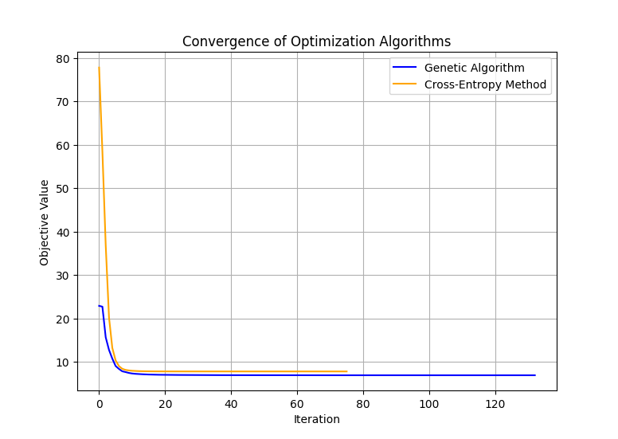

# Stochastic Optimizers

Python implementations of Genetic Algorithm and Cross-Entropy optimization methods.

Pure Python, simple, easy-to-use!

## Features

- **Genetic Algorithm** with:
  - Blend crossover
  - Adaptive mutation
  - Population-based optimization
  - Bounded search space

- **Cross-Entropy Method** with:
  - Gaussian sampling
  - Adaptive distribution updates
  - Elite selection


## Usage

### Genetic Algorithm
```python
import numpy as np
from stochastic_optimizers import GeneticAlgorithm

def sphere_func():
    def build_func(x):
        return np.sum(x ** 2, axis=1)
    return build_func

obj_func = sphere_func()

ga_opt = GeneticAlgorithm(obj_func, x_min=-1, x_max=1, num_samples=1000, max_iter=1000)
opt_x_ga, history_x_ga, history_obj_ga = ga_opt.optimize(return_history=True)
print("The output solution is {} with an objective value of {}.".format(np.round(opt_x_ga, 2), obj_func(opt_x_ga.reshape(1, -1))[0]))
```

### Cross-Entropy Method
```python
from stochastic_optimizers import minimize_ce

def rastrigin_func(num_variable=10, a=10):
    def build_func(x):
        return num_variable * a + np.sum(x ** 2 + a * np.cos(2 * np.pi * x), axis=1)
    return build_func

obj_func = rastrigin_func()

ce_opt = CrossEntropyOptimizer(obj_func, num_variables=10, num_samples=1000, max_iter=1000)
opt_x_ce, history_x_ce, history_obj_ce = ce_opt.optimize(return_history=True)
print("The output solution is {} with an objective value of {}.".format(np.round(opt_x_ce, 2), obj_func(opt_x_ce.reshape(1, -1))[0]))
```

## Parameters

### Genetic Algorithm
- `obj_func`: Objective function to minimize
- `x_min`, `x_max`: Search space bounds
- `keep_rate`: Fraction of top solutions to retain (default: 0.1)
- `num_variables`: Problem dimension (default: 10)
- `max_iter`: Maximum iterations (default: 1000)
- `num_samples`: Population size (default: 100)
- `eps`: Convergence tolerance (default: 1e-6)

### Cross-Entropy Method
- `obj_func`: Objective function to minimize
- `mu`: Initial mean (default: 0.5)
- `scale`: Initial standard deviation (default: 1.0)
- `num_variables`: Problem dimension (default: 10)
- `max_iter`: Maximum iterations (default: 1000)
- `num_samples`: Population size (default: 100)
- `elite_frac`: Fraction of elite samples (default: 0.1)
- `eps`: Convergence tolerance (default: 1e-6)


## Convergence Visualization
Convergence of two types of optimization method on Rosenbrock function.

- Genetic Algorithm (GA) excels at global optimization with robust population-based exploration, making it ideal for complex problems with noisy landscapes. 
- Cross-Entropy (CE) Method converges faster through adaptive Gaussian sampling, offering efficient parametric optimization for continuous, smooth objective functions with fewer tuning parameters.



## Citation

If you use this code for your research, please cite our paper.

```
@ARTICLE{li2024fimi,
  author={Li, Peichun and Zhang, Hanwen and Wu, Yuan and Qian, Liping and Yu, Rong and Niyato, Dusit and Shen, Xuemin},
  journal={IEEE Transactions on Mobile Computing}, 
  title={Filling the Missing: Exploring Generative AI for Enhanced Federated Learning Over Heterogeneous Mobile Edge Devices}, 
  year={2024},
  volume={23},
  number={10},
  pages={10001-10015}
}
```
